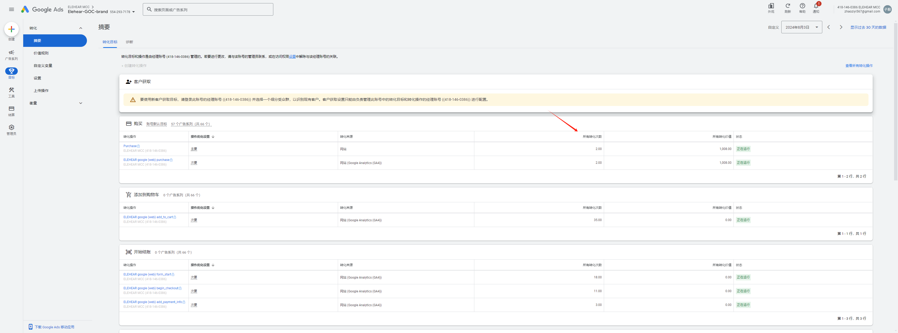

# Elehear Ops Panel
## 简介
此为Elehear运营部内部数据面板， 用于观测产品销售数据以及分析广告转化率
## 目录
- [简介](#简介)
- [数据说明](#数据说明)
- [数据更新说明](#数据更新说明)
- [部署](#部署)
## 数据说明
### **Shopify**
1. ***total_sales*** : shopify商店当日销售总金额(按用户实际支付金额计算)，不包括以下产品名的订单；
    ```sh
    'Shipping Fee'
    ```
2. ***AlphaPro_sales*** : 产品名为以下的销售金额(按用户实际支付金额计算)；
    ```sh
    'Alpha Pro'
    'Alpha Pro Ultimate Kit'
    'Alpha'
    ```
    
3. ***AlphaPro_oreders*** : 产品名为以下的销量(按实际销售数量计算，非订单量)；
    ```sh
    'Alpha Pro'
    'Alpha Pro Ultimate Kit'
    'Alpha'
    ```
4. ***Accessory_orders*** : 配件名为以下的销量(按实际销售数量计算，非订单量)；
    ```sh
    'Dry Box for ELEHEAR Alpha Series'
    'Single-layer Closed Ear Domes/Caps for ELEHEAR Alpha Series'
    'Double-layer Closed Ear Domes/Caps for ELEHEAR Alpha Series'
    'Wax Cap Tool for ELEHEAR Alpha Series *4'
    'Wireless Charger for ELEHEAR Alpha Series'
    ```
5. ***total_orders*** : shopify商店当日总订单量(以后台实际显示为准，非产品销量之和)，不包含以下产品名的订单；
    ```sh
    'Shipping Fee'
    ```
6. ***ads_spend*** : 广告投入总金额；
7. ***ads_income*** : 投广销售额；
8. ***ads_amount*** : 广告转化量(通过广告销售的产品数量)，四舍五入，具体定义以Google Ads后台为准；
9. ***ROAS*** : $\frac{\text{投广销售额}}{\text{广告投入总金额}}$ ；
10. ***total_traffic*** : 通过各渠道访问官网的流量数据，数据来源: Google Analytics；
11. ***conversion_rate*** : $\frac{\text{总订单量}}{\text{总流量}}$ ；
## 数据更新说明
## 部署


