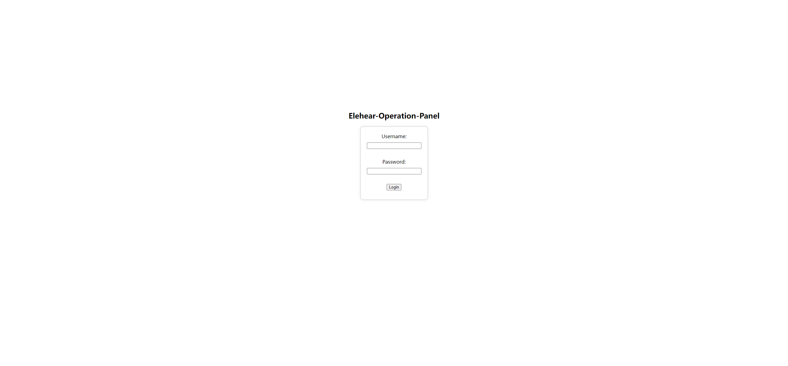
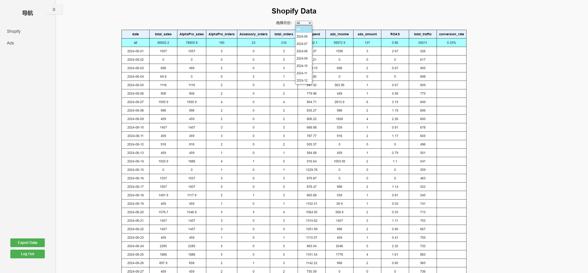
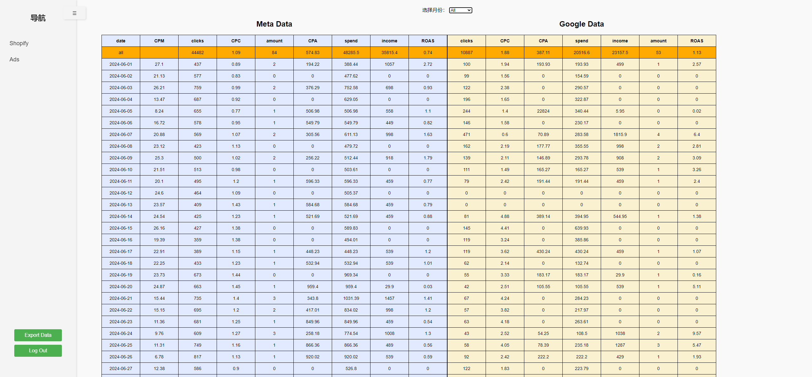

# Elehear Ops Panel
## 简介
Elehear Ops Panel是一个基于Flask框架的Web应用，前端使用基础的html+css+javascript框架，后端首先是通过单独的定时脚本使用shopify api, google-ads api, meta-ads api调取产品销售数据以及广告转化数据，将数据存储到MySQL数据库，再由Flask的后端函数直接从数据库调取数据到前端，用于分析广告转化率，此项目为Elehear运营部内部数据面板。
## 目录
- [简介](#简介)
- [特性](#特性)
- [预览](#预览)
- [数据说明](#数据说明)
- [数据更新说明](#数据更新说明)
- [部署](#部署)
- [Q&A](#qa)
## 特性
- ### 响应式设计：
    通过css进行媒体查询，实现了项目在手机端，平板端和桌面端的适配。
- ### API集成：
    使用GraphQL查询语言通过Shopify API获取数据；  
    使用RESTful API与Facebook Ads API，Google Ads API，Google Analytics API进行集成，获取数据。
- ### 性能优化：
    使用Redis对数据进行缓存，减少对数据库的操作；  
    通过AJAX异步加载数据，减少页面加载时间，提升用户体验。
- ### 数据更新：
    在服务器端使用crontab工具进行定时任务的配置，用于更新数据库数据；  
    使用Redis管理任务锁，防止重复执行定时任务。
- ### 安全：
    使用Flask的"session"和"secret_key"功能管理会话，保护用户数据；  
    用户信息使用bcrypt加密存储在数据库。
- ### 版本控制：
    使用gitlab和github分别进行对公司仓库和个人仓库的项目代码同步。
## 预览
登录页：
  
首页：
  
广告数据页：


## 数据说明
### **Shopify**
1. ***total_sales*** : shopify商店当日销售总金额(按用户实际支付金额计算)，不包括以下产品名的订单；
    ```sh
    'Shipping Fee'
    ```
2. ***AlphaPro_sales*** : 产品名为以下的销售金额(按用户实际支付金额计算)；
    ```sh
    'Alpha Pro'
    'Alpha Pro Ultimate Kit'
    'Alpha'
    ```
    
3. ***AlphaPro_oreders*** : 产品名为以下的销量(按实际销售数量计算，非订单量)；
    ```sh
    'Alpha Pro'
    'Alpha Pro Ultimate Kit'
    'Alpha'
    ```
4. ***Accessory_orders*** : 配件名为以下的销量(按实际销售数量计算，非订单量)；
    ```sh
    'Dry Box for ELEHEAR Alpha Series'
    'Single-layer Closed Ear Domes/Caps for ELEHEAR Alpha Series'
    'Double-layer Closed Ear Domes/Caps for ELEHEAR Alpha Series'
    'Wax Cap Tool for ELEHEAR Alpha Series *4'
    'Wireless Charger for ELEHEAR Alpha Series'   
    ```
5. ***total_orders*** : shopify商店当日总订单量(以后台实际显示为准，非产品销量之和)，不包含以下产品名的订单；
    ```sh
    'Shipping Fee'
    ```
6. ***ads_spend*** : 广告投入总金额；
7. ***ads_income*** : 投广销售额；
8. ***ads_amount*** : 广告转化量总和(通过广告销售的产品数量)
9. ***ROAS*** : $\frac{\text{投广销售额}}{\text{广告投入总金额}}$ ；
10. ***total_traffic*** : 通过各渠道访问官网的流量数据，数据来源: Google Analytics；
11. ***conversion_rate*** : $\frac{\text{总订单量}}{\text{总流量}}$ ；
### **Ads**
1. ***clicks*** : 广告点击量；
2. ***CPM*** : $\frac{\text{总广告费用}}{\text{总展示次数}}$ * 1000 (由meta平台直接提供)；
3. ***CPC*** : $\frac{\text{广告投入金额}}{\text{广告点击量}}$ ；
4. ***amount*** : 广告转化量(通过广告销售的产品数量)，四舍五入，具体定义以各平台后台为准；
5. ***CPA*** : $\frac{\text{广告投入金额}}{\text{广告转化量}}$ ；
6. ***spend*** : 广告投入金额；
7. ***income*** : 投广销售额；
8. ***ROAS*** : $\frac{\text{投广销售额}}{\text{广告投入金额}}$ ；
## 数据更新说明
1.每十分钟运行一次脚本(三个平台各一个)，使用api直接访问平台，更新数据库中当日数据（纽约时间）；
```sh
'shopify_daily_task_new.py'
'meta_daily_task.py'
'google_daily_task.py'('google_project.sh')
```
2.每天11:45执行meta和google的数据回溯脚本，更新前三日的数据（不包括当日）；每天11:55执行shopify的数据回溯脚本，更新前三日的数据（不包括当日），由于shopify平台的数据一般不存在滞后性，所以这里主要更新shopify数据库中关于广告的衍生数据；
```sh
'shopify_daily3_task_new.py'
'meta_daily3_task.py'
'google_daily3_task.py'('google3_project.sh')
```
## 部署
请保证在服务器中具有如下环境：
- Python >= 3.8
- Redis Server
- Mysql >= 5.5

请确保拥有shopify商店，google-ads账号, meta-ads账号，以及已获得对相关资产访问的api token，具体方法如下：
### Shopify
- 进入shopify账号首页，点击左侧的'Apps',进入'Develop apps'创建一个新的应用，创建时添加相关需要的权限，然后保存生成的API access token（仅可显示一次）和API key 以及API secret key，后面在相关脚本中替换；
### Meta
- 进入meta开发者账户页面，选择'My apps'，创建一个新的app，首先绑定你facebook账号具有访问权限的的业务资产组合，选择通过facebook账号来验证登录，成功创建app后在app内的产品中启用市场营销API，然后在工具中勾选ads_read权限并生成token，保存这个token在之后的相关代码中进行替换（meta的token有效期可能只有几个月，若token无故失效后可通过同样方式生成新的token）；
### Google
- google的流程较为复杂
- 首先进入google-ads账号首页(一定要是广告账户所属的经理账户)，在管理员设置中进入API中心（非经理账户无此选项），申请API访问权限，得到一个开发者令牌，后面在相关代码中进行替换，令牌初始权限为测试权限，无法正常使用，需要向google开发团队提交一个表单申请基本访问权限才可正常使用，审核时间大致为3-5天。
- 在得到权限之后访问console.cloud.google.com，新建一个项目，启用Google Ads API和Google Analytics Data API，在凭据页面创建一个适用于web client的Oauth凭据，进行具体的关于重定向url的配置；
- 通过 developvers.google.com/oauthplayground 工具获取refresh token，首先在右上角设置里面选择使用自己的OAuth信息，输入上面创建的Oauth凭据的id和密码，然后在左侧step1中选择要使用api请求的端点（google ads 和google analytics），添加完成后在step2中生成refresh token（Google令牌理论上是长期令牌），后面在相关代码中进行替换。

通过Git Clone或下载源代码的方式将本项目克隆到服务器项目目录中：
```sh
git clone https://github.com/Tabby-Cat798/Elehear-Ops-Panel.git
```

建立mysql数据库，库名和密码可自定义，也可使用代码中配置。建立数据库表shopify_new，google，meta，表结构请参照如下截图：
```sh
mysql> describe shopify_new;
+------------------+---------+------+-----+---------+-------+
| Field            | Type    | Null | Key | Default | Extra |
+------------------+---------+------+-----+---------+-------+
| date             | date    | NO   | PRI | NULL    |       |
| total_sales      | float   | NO   |     | NULL    |       |
| AlphaPro_sales   | float   | NO   |     | NULL    |       |
| AlphaPro_orders  | int(11) | NO   |     | NULL    |       |
| Accessory_orders | int(11) | NO   |     | NULL    |       |
| total_orders     | int(11) | NO   |     | NULL    |       |
| ads_spend        | float   | YES  |     | NULL    |       |
| ads_income       | float   | YES  |     | NULL    |       |
| ads_amount       | int(11) | YES  |     | NULL    |       |
| ROAS             | float   | YES  |     | NULL    |       |
| total_traffic    | int(11) | NO   |     | NULL    |       |
+------------------+---------+------+-----+---------+-------+
mysql> describe google;
+--------+---------+------+-----+---------+-------+
| Field  | Type    | Null | Key | Default | Extra |
+--------+---------+------+-----+---------+-------+
| date   | date    | NO   | PRI | NULL    |       |
| clicks | int(11) | NO   |     | NULL    |       |
| CPC    | float   | NO   |     | NULL    |       |
| CPA    | float   | NO   |     | NULL    |       |
| spend  | float   | NO   |     | NULL    |       |
| income | float   | NO   |     | NULL    |       |
| amount | int(11) | NO   |     | NULL    |       |
| ROAS   | float   | NO   |     | NULL    |       |
+--------+---------+------+-----+---------+-------+
mysql> describe meta;
+--------+---------+------+-----+---------+-------+
| Field  | Type    | Null | Key | Default | Extra |
+--------+---------+------+-----+---------+-------+
| date   | date    | NO   | PRI | NULL    |       |
| CPM    | float   | YES  |     | NULL    |       |
| clicks | int(11) | YES  |     | NULL    |       |
| CPC    | float   | YES  |     | NULL    |       |
| amount | int(11) | YES  |     | NULL    |       |
| CPA    | float   | YES  |     | NULL    |       |
| spend  | float   | YES  |     | NULL    |       |
| income | float   | YES  |     | NULL    |       |
| ROAS   | float   | YES  |     | NULL    |       |
+--------+---------+------+-----+---------+-------+
```

通过脚本获取三个平台中现有的数据，打开以下文件，修改全局中数据库的配置信息，API token以及账户的信息，在函数中修改你想获取的具体数据名，在函数调用中修改参数为数据获取的开始日期，在函数循环中的迭代次数修改为数据获取的截至日期（"<="后面），每个脚本一次只能获取一个月的数据，随后在终端中分别运行以下脚本(如缺少依赖请按照系统报错先安装依赖)：
```sh
'shopify_mysql_total.py'
'meta_mysql.py'
'google_mysql.py'
```

通过脚本进行数据库中三个表的数据实时更新，打开以下文件，进行上一步相同的配置信息修改，另外要记得修改redis锁的password(redis锁可以防止脚本的运行间隔时间较短时，同一时间内运行多次相同脚本，导致对同一数据表的并发操作)，随后在终端中输入'crontab -e'进入系统任务的设置，插入以下信息以确保所有脚本自动运行，脚本的路径记得进行修改（这里因为当时系统python版本为3.6.8，并没有google-ads的相关库，所以使用了更高python版本的虚拟环境，sh文件则为激活虚拟环境+运行'google_daily_task.py'，若你的python版本大于3.8，则直接设置为'google_daily_task.py'和'google_daily3_task.py'就好）：
```sh
*/10 * * * * /usr/bin/python3 /www/wwwroot/panel/meta_daily_task.py
*/10 * * * * /usr/bin/python3 /www/wwwroot/panel/shopify_daily_task_new.py
*/10 * * * * /www/wwwroot/panel/google_project.sh
45 11 * * * /www/wwwroot/panel/google3_project.sh
55 11 * * * /usr/bin/python3 /www/wwwroot/panel/shopify_daily3_task_new.py
45 11 * * * /usr/bin/python3 /www/wwwroot/panel/meta_daily3_task.py
```
替换app.py文件中的数据库信息，若在以上步骤中更改了所获取的数据及数据名，请在相关函数中同步修改，然后确保一切信息无误后，在服务器中使用以下脚本运行：
```sh
nohup gunicorn -w 4 -b 0.0.0.0:5000 app:app &
```

若能使用服务器ip+端口号(5000)成功访问到面板，则项目成功部署！

## Q&A
> Q：数据不更新了怎么办？  

 大概率是某个平台的API token过期或者账号的权限被移除，一般情况下除了meta平台，其余平台的token都是长期有效，若出现问题请联系项目开发者，其中meta平台的解决方法：  
1. Meta:
https://developers.facebook.com/apps/?show_reminder=true  
登录meta开发者平台，使用Facebook账号登录
选择App，点击左侧 产品 > 市场营销API > 工具，勾选ads_read权限，然后点击get token得到新的token；  
在以下代码文件中更换"access_token"： 
```sh
meta_mysql.py
meta_daily_task.py
meta_daily3_task.py
```
> Q：数据与平台实际提供的不匹配怎么办？

 因为某些平台的数据会出现回溯，针对这种现象我们为每个平台都部署了一个每日回溯前三日数据的脚本(具体解释请查阅[数据更新说明](#数据更新说明))，若出现问题的数据已经超出了回溯脚本所覆盖的时间范围，请在设置好目标时间的前提下手动执行相应的mysql脚本，更新相应数据，并适当增加对应回溯脚本覆盖的时间(由于考虑到对数据库的并发操作，不建议覆盖时间过长)；

> Q：Shopify商店发布了新的产品或者配件该怎么办？

 首先更新Mysql数据表中相应的名称，然后在shopify的三个脚本中分别进行修改，在其中的process_shopify_data()函数和store_sales_data()函数中修改为最新的产品或配件tittle(当前tittle请查阅[数据说明](#shopify))，随后先运行shopify_mysql.py更新过去日期中的数据，然后重启app.py即可；
 

